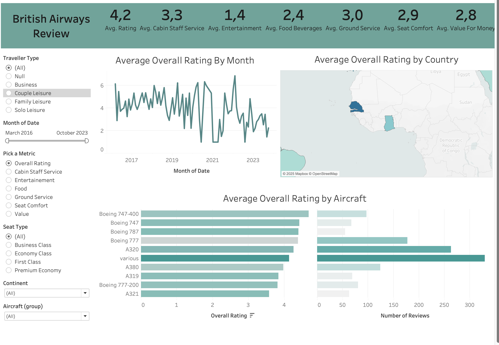

# British Airways Customer Reviews Dashboard

## Project Overview  
Customer satisfaction is a key success metric for any airline, influencing brand loyalty and service quality improvements.  
This project uses **Tableau** to analyze **British Airways** customer reviews, uncovering insights through interactive visualizations.  
By exploring key performance indicators such as **overall ratings**, **cabin staff service**, and **review geography**, the dashboard provides a data-driven understanding of British Airways’ service performance and areas for potential improvement.

---

## 📂 Project Files  

| File | Description |
|------|--------------|
| [`british_airways_dashboard.twbx`](./british_airways_dashboard.twbx) | Tableau Dashboard File |
| [`british_airways_reviews.csv`](./british_airways_reviews.csv) | Raw dataset containing customer review data |

*(Make sure both files are in the repository root folder or update the links if placed elsewhere.)*

---

## Steps Performed  

1. **Data Import**  
   - Imported airline review data from the provided Excel file into **Tableau Public**.  

2. **Trend Analysis**  
   - Built **time-series line charts** to visualize rating trends by **month** and **year**, identifying satisfaction patterns over time.  

3. **Aircraft & Geographic Insights**  
   - Created **horizontal bar charts** comparing ratings across aircraft models (e.g., *Boeing 747, A320*).  
   - Displayed **number of reviews per aircraft** to provide context on passenger feedback volume.  
   - Designed a **map visualization** showing **average ratings by country**, revealing global sentiment patterns.  

4. **Dashboard Design**  
   - Combined visuals into an **interactive dashboard** using filters for **aircraft type**, **seat class**, **traveller type**, and **continent**.  
   - Enabled dynamic exploration of customer feedback across multiple perspectives.  

---

## Key Insights  

- **Geographical Insights:**  
  Interactive map highlights country-wise ratings, identifying strong and weak satisfaction regions.  

- **Aircraft Performance:**  
  - 🛫 **Boeing 747-400** — ⭐ **4.2** (Highest rated)  
  - 🛬 **A321** — ⭐ **3.6** (Lowest rated)  

- **Service-Level Breakdown:**  

  | Service Aspect | Avg. Rating |
  |:------------------|:-------------:|
  | Cabin Staff | ⭐ 3.3 |
  | Entertainment | ⭐ 1.4 |
  | Food & Beverages | ⭐ 2.4 |
  | Seat Comfort | ⭐ 2.9 |
  | Value for Money | ⭐ 2.8 |

- **Interactive Filters:**  
  Allows exploration by traveller type, seat class, aircraft group, and continent.  

---

## Impact  

The **British Airways Dashboard** offers a **360° view** of customer experience, enabling decision-makers to:  
- Identify low-performing service areas (e.g., entertainment, comfort).  
- Focus improvements on underperforming aircraft or routes.  
- Make data-driven, strategic service enhancements.  

---

## Tools & Skills Used  

- **Tableau** — Data visualization & dashboard design  
- **Data Visualization** — KPI-based storytelling  
- **Business Analytics** — Insight generation & performance tracking  
- **Excel** — Data cleaning & preparation  

---

## 🏁 Conclusion  

This Tableau dashboard transforms complex airline review data into **clear, actionable insights**.  
It highlights how **visual storytelling** can bring data to life and guide decision-making in the aviation industry.  

---

## 🚀 How to Use  

1. Download or clone this repository.  
2. Open `british_airways_dashboard.twbx` in **Tableau Public** or **Tableau Desktop**.  
3. Explore filters and visualizations interactively to uncover insights.  
4. Review the source data in `british_airways_reviews.xlsx` if needed.

---

## 📸 Preview  

> 

---

## 🧑‍💻 Author  

**Hadil Sahraoui**  
🔗 [LinkedIn Profile](https://www.linkedin.com/in/hadil-sahraoui)  
